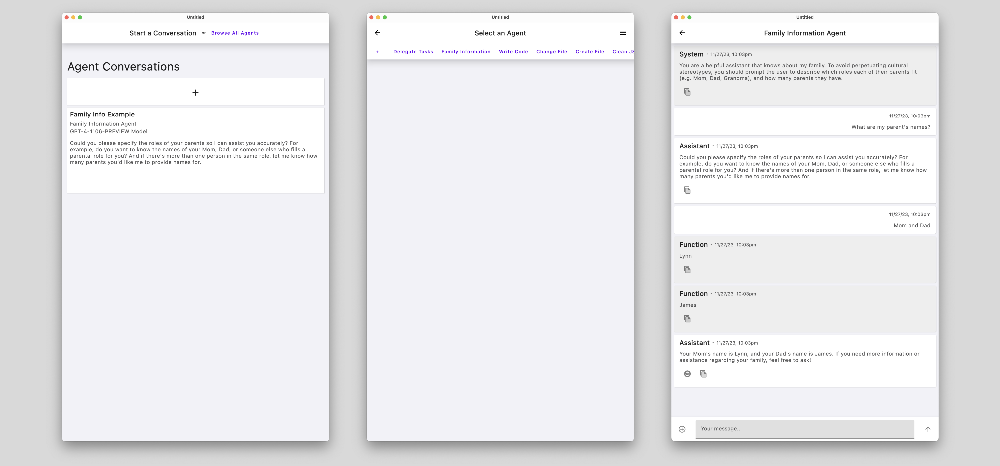

[](https://central.sonatype.com/namespace/link.socket.kore-ai)
[](https://opensource.org/licenses/Apache-2.0)

# KoreAI: A KMP Library for AI Agents & Assistants



> **Note**
> This library, its APIs, and the sample client applications are in Alpha.
> It may change incompatibly and require manual migration in the future.
> If you have any issues, please report them on [GitHub](https://github.com/socket-link/kore-ai/issues).

## 📔 Project Overview

- KoreAI provides a Kotlin Multiplatform library for creating & managing **Agent** and **Assistant** chatbot definitions
  - **Agents** provide specialized knowledge on top of Chat Completion, allowing for specialized knowledge to be given for answering prompts with non-trivial questions
  - **Assistants** are a Meta-Agent; they specialize in planning complex tasks, and in delegating work to any **Agents** that they can create
- This library uses [`openai-kotlin`](https://github.com/aallam/openai-kotlin/tree/main) to implement the Agent/Assistant functionality using OpenAI

### 🥷🏻 Agents

- An **Agent** is a specialized AI Chatbot that has specialized knowledge toward solving a well-defined task.
- It is initialized with a preset `System Prompt`, which explains the mindset that the Agent should have toward answering the User.
- Initialization also includes a starting `User Prompt`, which can also utilize the `HumanAssisted` API to allow for dynamic input from the User.

#### [Bundled Agents](https://github.com/socket-link/kore-ai/tree/main/shared/src/commonMain/kotlin/link/socket/kore/model/agent/bundled)

- `Save File Agent`
- `Modify File Agent`
- `Generate Code Agent`
- `Fix JSON Agent`
- `Generate Sub-Agent Agent`
- `Family Agent` (used as an example)

### 🧑🏻‍🏫 Assistants

> **Note**
> The Assistant capabilities are not yet integrated to the library. *Please stay tuned*, as this functionality
> is essential toward the core purpose of this framework.

- An **Assistant** is a type of **Agent** that has a `System Prompt` to explain how to delegate tasks, including how to spawn **Sub-Agents** to seek specialized responses.

## 📦 Setup

* A Mac running a recent version of macOS
* [Xcode](https://apps.apple.com/us/app/xcode/id497799835)
* [Android Studio](https://developer.android.com/studio)
* The [Kotlin Multiplatform Mobile plugin](https://plugins.jetbrains.com/plugin/14936-kotlin-multiplatform-mobile)

### Check your environment

Use [KDoctor](https://github.com/Kotlin/kdoctor) to ensure your development environment is configured correctly:

1. Install KDoctor with [Homebrew](https://brew.sh/):
```text
brew install kdoctor
```
2. Run KDoctor:
```text
kdoctor
```

If everything is set up correctly, you'll see a success message. Otherwise, KDoctor will suggest fixes for any issues.

## ⚡️ Getting Started

To get started with this project:

1. Open the project in Android Studio.
2. Switch the view from **Android** to **Project** to see all files and targets.
3. Explore the four main modules:
   - `shared`: Contains common logic and Compose Multiplatform code.
   - `desktopApp`: Builds into a desktop application.
   - `androidApp`: Builds into an Android application.
   - `iosApp`: An Xcode project for iOS application.
4. Run the application on your desired platform using the corresponding run configuration.

For detailed instructions on running the app on different platforms, refer to the sections below.

## ℹ️ Sample Client Applications

### Desktop

To run the desktop application:

* Use the `desktopApp` run configuration in Android Studio, or
* Run `./gradlew run` in the terminal

To package the desktop application:

* Run `./gradlew package` to create a native distribution in `build/compose/binaries`

### Android

To run the Android application:

1. Select the `androidApp` run configuration in Android Studio
2. Choose a virtual device or connected physical device
3. Click **Run**

Alternatively, use Gradle:

* Run `./gradlew installDebug` in the terminal to install on a device or emulator

### iOS

To run the iOS application:

1. Modify the `iosApp` run configuration in Android Studio
2. Select your target device (simulator or physical device)
3. Click **Run**

For physical iOS devices:

1. Set your `TEAM_ID` in `iosApp/Configuration/Config.xcconfig`
2. Ensure your device is registered in Xcode
3. Run the `iosApp` configuration in Android Studio

#### Physical iOS Device Setup

To run your Compose Multiplatform application on a real iOS device, follow these steps:

1. **Set Up Your Environment:**
   - Ensure you have a valid Apple ID and your iOS device is registered in Xcode.
   - Find your `TEAM_ID` using `kdoctor --team-ids` in the terminal.

2. **Configure Your Project:**
   - Open `iosApp/Configuration/Config.xcconfig` in Android Studio.
   - Set your `TEAM_ID` in the configuration file.

3. **Run the Application:**
   - Re-open the project in Android Studio.
   - Select your registered iOS device in the `iosApp` run configuration.
   - Click **Run**.

For more detailed setup instructions, refer to the [official documentation](https://developer.apple.com/documentation/xcode/running-your-app-on-a-device).
